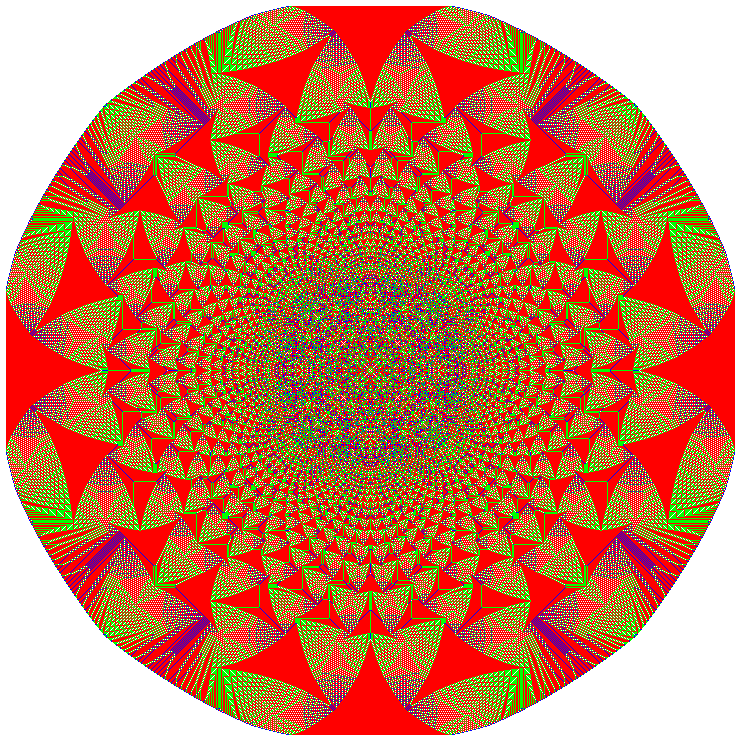

# Sandpile Sim
Implements the sandpile algorithm and creates a png file of the result!

### Install Rust
To download Rustup and install Rust, run the following in your terminal, then follow the on-screen instructions. See ["Other Installation Methods"](https://forge.rust-lang.org/infra/other-installation-methods.html) if you are on Windows.
```bash
curl --proto '=https' --tlsv1.2 -sSf https://sh.rustup.rs | sh
``` 
### Build and Compile
`git clone` this repository then `cargo run --release` on main branch for optimal performance

### How to use
`cargo run --release -- -n 4200 -l 49`

| Command Line Argument | Function                                                               | 
|:----------------------|:-----------------------------------------------------------------------|
| `-n <integer>`        | number of grains in the middle of the grid                             |
| `-l <integer>`        | side length of the square grid                                         |
| `-p <floating point>` | probability threshold for skipping a grain move to neighbouring cell   |

Run the program in release mode and enjoy the patterns!

